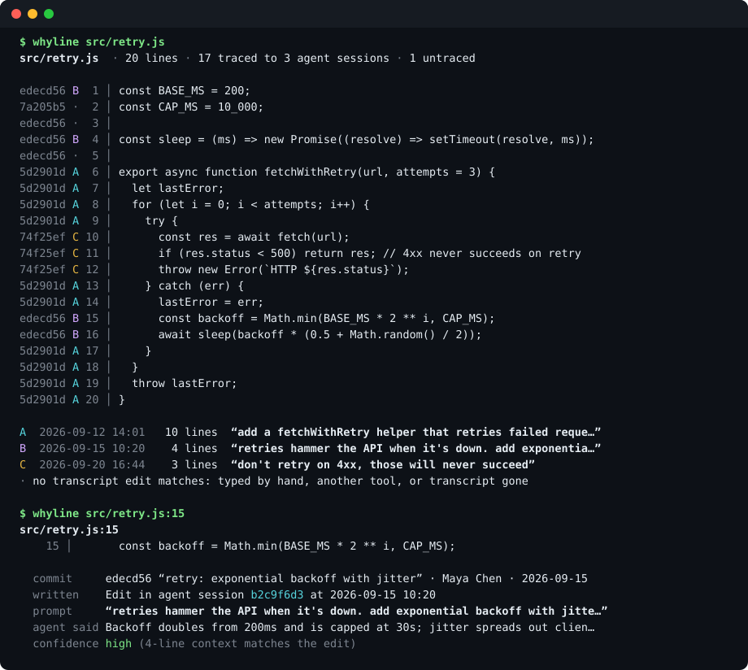
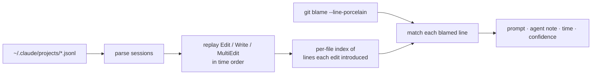

<h1 align="center">whyline</h1>

<p align="center"><b><code>git blame</code> tells you who. <code>whyline</code> tells you which prompt.</b><br>
Trace any line of code back to the coding-agent session that wrote it, using the transcripts already on your disk.</p>

<p align="center">
  <a href="https://github.com/Nithinfgs/whyline/actions/workflows/ci.yml"></a>
  <a href="LICENSE"></a>
  
  
</p>

<p align="center"><br><sub>Real output of <code>whyline --demo</code> on a generated sample repo (3 agent sessions and one human edit).</sub></p>

## In 20 seconds

You open a file and find `const backoff = Math.min(BASE_MS * 2 ** i, CAP_MS)`. `git blame` says *"Maya, 3 weeks ago, 'retry: exponential backoff'"*. That doesn't say what was asked, or what the agent thought it was doing.

`whyline` joins two things you already have:

1. **`git blame`** for the file, and
2. **your Claude Code transcripts** (`~/.claude/projects/**/*.jsonl`), where every `Edit`, `Write` and `MultiEdit` the agent made is recorded next to the prompt that triggered it.

It replays those edits, matches them to the blamed lines, and prints the **prompt**, the agent's explanation, the time, and how sure it is. No hooks to install, no history to rebuild: it works retroactively on sessions you have already run. Everything stays on your machine.

## Quick start

Requires Node 20+ and git. Try it on a generated sample repo first (touches nothing of yours):

```bash
npx github:Nithinfgs/whyline --demo
```

Then on your own repo, from anywhere inside it:

```bash
npx github:Nithinfgs/whyline src/app.ts          # provenance map of the whole file
npx github:Nithinfgs/whyline src/app.ts:42       # why does line 42 exist?
npx github:Nithinfgs/whyline src/app.ts:40-58    # a range, grouped by origin
```

Or install it once: `npm install -g github:Nithinfgs/whyline`, then run `whyline …`. (An npm registry release is planned; until then the GitHub install above is the supported route.)

## Reading the output

```
$ whyline src/retry.js:15

  commit      edecd56 “retry: exponential backoff with jitter” · Maya Chen · 2026-09-15
  written     Edit in agent session b2c9f6d3 at 2026-09-15 10:20
  prompt      “retries hammer the API when it's down. add exponential backoff with jitter…”
  agent said  Backoff doubles from 200ms and is capped at 30s; jitter spreads out clients…
  confidence  high (4-line context matches the edit)
```

In the whole-file map each line gets a commit, and a letter for the agent session that wrote it. `·` means no transcript edit matches: the line was typed by a person (line 2 above, the human who lowered a cap), came from another tool, or its session log is gone. Lines are only credited to an agent when the text really appears in a recorded edit.

`--json` emits the same data for scripts, editors and CI.

## Why this exists

Agent-written code is now a normal part of a diff, but the *reason* for a change lives in a chat that nobody opens again. Commit messages are short, sessions are long, and "the agent did it" is not an explanation. Existing tools record AI authorship going forward (hooks, git notes) or summarise token usage. `whyline` answers the reviewer's and maintainer's question after the fact, for code that already exists, using logs you were already keeping.

Typical moments:

- **Reviewing a surprising line** in your own or a teammate's branch: what was the agent asked?
- **Debugging a regression**: was this behaviour requested, or invented?
- **Onboarding to an agent-heavy codebase**: which areas were prompted, which were hand-written?
- **Writing a better commit or PR description** from the prompts that produced the change.

## How it works



- **Replay, don't grep.** Edits are applied in time order across sessions, tracking file content where possible. A line only counts as *introduced* by an edit if it was not already there, so an `Edit` that merely shows surrounding context, or a whole-file `Write` that re-emits old lines, does not steal credit.
- **Rank candidates** by: the edit happened before the commit that introduced the line (with 15 minutes of clock slack), then the number of identical neighbouring lines (up to two each side), then recency.
- **Confidence is explicit.** `high` needs strong neighbouring-line agreement and no competing session; identical text produced by two sessions lowers it. Braces and other trivial lines are never attributed without context.
- **Prompt = the last human message before the edit** in that session. Tool output, system reminders and sub-agent chatter are filtered out. Obvious secrets (API keys, tokens, `password=…`) are redacted from anything printed.
- Sessions are found by the repo's path in `~/.claude/projects`, including worktrees and sessions started in a parent directory. Override with `--transcripts DIR` or `WHYLINE_TRANSCRIPTS`.

More detail and the edge cases: [docs/how-it-works.md](docs/how-it-works.md).

## Limitations

whyline is a heuristic. Read the confidence label.

- **Claude Code transcripts only** for now. Other agents need an adapter ([contributions welcome](CONTRIBUTING.md)).
- **Matching is by text.** If a formatter, a rebase conflict resolution, or you changed the line after the agent wrote it, it will show as untraced rather than guess.
- **The prompt is the nearest one, not necessarily the best one.** In a long back-and-forth the line may trace to a recent follow-up ("now rename it") rather than the original request. The `agent said` note and the session id help you find the rest.
- **Moved code** that was cut and pasted by hand is untraced.
- Tested on macOS and Linux. Windows is untested.
- Deleted or pruned transcripts can't be recovered. Claude Code may clean up old sessions; keep them if you want long-term provenance.

## Configuration

There is deliberately little.

| Flag / variable | Meaning |
| --- | --- |
| `--transcripts DIR` / `WHYLINE_TRANSCRIPTS` | Read `.jsonl` sessions from `DIR` instead of `~/.claude/projects` |
| `CLAUDE_CONFIG_DIR` | Honoured when locating the default transcript directory |
| `--json` | Machine-readable output |
| `--summary` | With a bare file: legend only, no per-line map |
| `--no-color`, `NO_COLOR` | Plain output |

## Roadmap

- [ ] Adapters for other agents' session logs (Codex CLI, Gemini CLI, Cursor)
- [ ] Token-level fuzzy matching so formatter-touched lines still trace
- [ ] `whyline log <rev>`: the prompts behind a commit or PR, ready for a description
- [ ] Editor hover (VS Code) built on `--json`
- [ ] Windows in CI

Ideas and real-world transcripts that break it (with secrets removed) are the most valuable contributions. See [CONTRIBUTING.md](CONTRIBUTING.md).

## Development

```bash
git clone https://github.com/Nithinfgs/whyline && cd whyline
npm install
npm run check      # eslint + tsc (strict, JSDoc types) + node:test
npm run demo       # sample repo
npm run render-demo  # regenerate docs/assets/demo.svg from real output
```

No build step: plain ES modules, typed with JSDoc and checked by `tsc`.

## License

[MIT](LICENSE)
